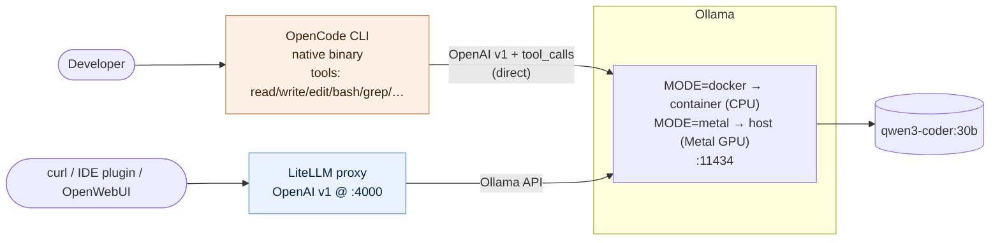

# maude

**Real agentic coding, fully on your laptop.**

<sub>**no cloud** · **no Claude** · **no API key** · **no internet** · **no bill at the end of the month**</sub>

A coding agent that reads, writes, greps, and shells against your codebase
— and never phones home. Open-weight model on your own GPU, structured
tool calls for real file edits, the whole stack in one repo. After the
first asset fetch, the network cable can come out.

- **No cloud.** Nothing leaves the machine. No API rate limits, no
  proxy in front of your code, no trust handed to a vendor's data
  retention policy.
- **No Claude.** No OpenAI. No Gemini. The whole inference pipeline is
  Qwen 3 Coder 30B-A3B running on your own Apple Silicon (or any GPU
  Ollama supports).
- **Offline.** Run `./fetch-assets.sh` once with internet to bundle the
  images and model. After that, `./turnup.sh` boots the whole stack with
  zero outbound calls. No telemetry. No update pings.
- **$0/month.** Hosted coding agents bill per million tokens. maude bills
  electricity. A long refactor session is cents.

It is not Claude Opus. It will not one-shot a multi-file migration on a
new codebase. But for short, well-scoped agentic edits — write this file,
fix this bug, refactor this function, scaffold this test — it is *good
enough that you actually use it*, and it costs nothing to run.

## Features

- **One-command turnup.** `./turnup.sh` brings up the LiteLLM + Ollama
  backend; `./maude` launches OpenCode against the local model.
  `./maude-cpu` and `./maude-gpu` are thin wrappers that preset the backend
  mode.
- **Two backend modes**, picked by `MODE=docker` (default) or `MODE=metal`:
  - `docker` — Ollama runs as a container. Single self-contained stack.
    CPU inference on macOS (Linux containers can't see Apple's Metal GPU).
    Saturates all cores during generation.
  - `metal` — Ollama runs natively on the macOS host with Metal/GPU
    acceleration. Roughly 5–10× faster generation on Apple Silicon and
    keeps the CPU idle. Only LiteLLM lives in compose.
- **OpenAI-compatible endpoint** at `http://127.0.0.1:4000` via LiteLLM,
  so non-agent clients (curl, OpenWebUI, IDE plugins, custom scripts) work
  against the local model without code changes.
- **Agentic coding via OpenCode**, a single static binary. OpenCode talks
  directly to Ollama's `/v1` endpoint (bypassing LiteLLM — see Architecture
  for why) and uses real structured function-calling: the model can
  `write`, `edit`, `bash`, `read`, `grep`, etc. against your CWD.
- **Reproducible offline turnup.** `./fetch-assets.sh` once on an online
  machine produces a self-contained `./assets/` tree (saved Docker images
  + Ollama model blobs); `./turnup.sh` on the offline machine then never
  touches the network. Idempotent — re-runnable, skips work already done.
- **Pinned versions** end to end — Ollama 0.4.7, LiteLLM main-stable,
  OpenCode (`anomalyco/tap`), Qwen 3 Coder 30B-A3B (MoE). Mode swaps don't
  change the model behaviour.
- **Local-only by design.** Both LiteLLM and Ollama bind to `127.0.0.1`.
  No telemetry, no outbound calls after fetch-assets completes.
- **Healthchecked.** Containers expose proper Docker healthchecks; turnup
  blocks until services report healthy before printing success.
- **Profile-scoped services.** Ollama lives in the `docker-backend`
  Compose profile so metal mode excludes it cleanly.

## Tech stack

| Layer | Component | Pinned version | Role |
|---|---|---|---|
| Model | [Qwen 3 Coder 30B-A3B](https://ollama.com/library/qwen3-coder) | `qwen3-coder:30b` | MoE coder model — 30 B total / 3.3 B active per token. ~19 GB on disk, 256 k native context, designed for function-calling and agentic tool use. |
| Model server | [Ollama](https://ollama.com) | `ollama/ollama:0.4.7` | Loads the GGUF weights, exposes the Ollama HTTP API on :11434. Metal-aware on host; CPU-only in containers. |
| OpenAI shim | [LiteLLM](https://github.com/BerriAI/litellm) | `ghcr.io/berriai/litellm:main-stable` | Exposes OpenAI v1 at :4000 for clients that don't need tool calling (curl, IDE plugins, OpenWebUI). OpenCode bypasses this and talks to Ollama's `/v1` directly because of a [LiteLLM bug forwarding `tool_calls`](https://github.com/BerriAI/litellm/issues/19742). |
| Agent | [OpenCode](https://opencode.ai) | `anomalyco/tap/opencode` | Native static binary. Reads `opencode.json` from the repo, talks Ollama's OpenAI-compat endpoint directly, edits files with structured tool calls. No container, no UID juggling. |
| Orchestration | Docker Compose v2 | n/a | Single `docker-compose.yml`; the `docker-backend` profile gates the in-container Ollama. |
| Glue | Bash scripts | — | `fetch-assets.sh`, `turnup.sh`, `maude`, `maude-cpu`, `maude-gpu`. Tested with `set -euo pipefail`. |
| Asset storage | local filesystem (default) | — | `assets/` is gitignored. Git LFS patterns are pre-declared in `.gitattributes` if you want to vendor them. |

## About the model — Qwen 3 Coder 30B-A3B

**Maker.** [Alibaba Cloud's Qwen team](https://qwenlm.github.io/). The
Qwen 3 series launched in April 2025; the code-specialised
**Qwen3-Coder-30B-A3B-Instruct** variant followed on July 31, 2025.
Apache-2.0 weights via Hugging Face and the Ollama registry.

**Architecture.** Mixture-of-Experts (MoE): **30 B total parameters but
only ~3.3 B activated per token** — 128 experts, 8 selected per token via
a learned router, across 48 transformer layers with Grouped Query
Attention. The MoE design means generation speed roughly matches a dense
3.3 B model while quality matches a much larger dense model.

**Why it replaced Qwen 2.5 Coder here.** Qwen 2.5 Coder didn't reliably
emit structured OpenAI-style `tool_calls` over the Ollama API — it would
write tool invocations as markdown-fenced JSON in the response body, which
OpenCode can't execute. Qwen 3 Coder was designed for "function calls,
browser use, and structured code completion" and works with OpenCode,
Cline, Claude Code, and similar agents out of the box.

**Capabilities.**

- Native **function calling** in the OpenAI tool-use schema — the part
  that makes file-editing agents actually edit files.
- Code generation, completion, repair across many languages.
- 256 k **native** context window (limited to 32 k by `opencode.json` here
  so it fits comfortably in the Docker VM's RAM ceiling).
- "Thinking" and "non-thinking" modes switchable in-prompt — useful for
  multi-step planning vs. fast turn-around.
- Score 20 on the Artificial Analysis Intelligence Index — above average
  for open-weight non-reasoning models of similar size.

### How does it compare to Claude Opus?

Honest answer: it's a different weight class, and the framing depends on
what you're measuring.

| Dimension | Qwen 3 Coder 30B-A3B (local) | Claude Opus 4.7 (hosted) |
|---|---|---|
| Parameters | 30 B total / 3.3 B active per token (MoE, open weights) | not disclosed; orders of magnitude larger |
| Where it runs | Your laptop, offline, no API key | Anthropic API, paid, requires internet |
| Native tool / function calling | Yes (the whole reason it's here) | First-class |
| **SWE-bench Verified** (real GitHub issues, agentic) | Solid for an open model; still well behind frontier hosted | **82.4 %** — current state-of-the-art |
| Long-horizon agentic work, multi-file refactors | Decent on short loops; loses thread on long chains | Strong; what Claude Code is built on |
| Multimodal input (images, PDFs, diagrams) | No | Yes |
| Privacy / data residency | Stays on your disk | Sent to Anthropic's API |
| Latency for short replies | A few seconds local (GPU) | Sub-second typical |
| Cost per token | $0 after install | Hosted pricing |

**The honest framing.** Qwen 3 Coder 30B-A3B is the first open-weight
local model that makes a setup like this *actually agentic* — it can
read, write, grep, run shells through OpenCode without hand-holding. For
short, well-scoped tasks it's genuinely useful. For long-horizon work
across a large codebase, Opus still pulls ahead by a wide margin. Use the
right tool for the size of the task.

### Further reading

- Qwen 3 Coder on Ollama — [ollama.com/library/qwen3-coder](https://ollama.com/library/qwen3-coder)
- Qwen 3 Coder GitHub — [QwenLM/Qwen3-Coder](https://github.com/QwenLM/Qwen3-Coder)
- Hugging Face: Qwen3-30B-A3B — [huggingface.co/Qwen/Qwen3-30B-A3B](https://huggingface.co/Qwen/Qwen3-30B-A3B)
- OpenCode + Qwen3-Coder write-up — [KDnuggets](https://www.kdnuggets.com/seeing-whats-possible-with-opencode-ollama-qwen3-coder)
- Anthropic Claude Opus 4.7 benchmarks — [Vellum write-up](https://www.vellum.ai/blog/claude-opus-4-7-benchmarks-explained)

## Architecture



OpenCode talks **directly** to Ollama's OpenAI-compat endpoint
(`:11434/v1`) because LiteLLM currently has a [known bug forwarding
structured `tool_calls`](https://github.com/BerriAI/litellm/issues/19742)
from `ollama_chat`. LiteLLM stays in the stack as the OpenAI-compat
endpoint for everything else that doesn't need tool calling (curl, IDE
plugins, OpenWebUI, custom scripts).

## Prerequisites

- **Docker** Desktop / Engine / OrbStack on macOS, Windows, or Linux, with Compose v2.
- **OpenCode** binary: `brew install anomalyco/tap/opencode`
  (or use the `curl` one-liner from [opencode.ai](https://opencode.ai)).
- For `MODE=metal`: macOS on Apple Silicon and `brew install ollama`.
- ~22 GB free disk for the qwen3-coder:30b bundle (~3 GB images + ~19 GB model).
- 32 GB unified memory recommended:
  - docker mode: large MoE model in CPU on a 32 GB Mac is workable but slow.
  - metal mode: the model lives in unified memory and uses the GPU; this is
    the intended path.

## Deployment guide

### 1. One-time asset fetch (needs internet)

The repo ships only code. Run the fetch script once on a machine with
internet to populate `./assets/`:

```bash
git clone git@github.com:binRick/maude.git
cd maude
./fetch-assets.sh
```

This will:

1. `docker pull` Ollama and LiteLLM at pinned versions and `docker save`
   each into `assets/images/*.tar` *immediately* after pull (Docker
   Desktop's auto-GC otherwise eats unsaved images during step 2).
2. Spin up a throwaway Ollama with `assets/ollama-data/` mounted and
   `ollama pull qwen3-coder:30b`, so all the model blobs land in the repo.

End state: `assets/` is ~22 GB (~3 GB images + ~19 GB model). The repo's
`.gitignore` skips `assets/` by default; see "Storage notes" below for
options if you want to vendor it.

OpenCode is *not* bundled here — it's a separate native install
(`brew install anomalyco/tap/opencode`). It's a single static binary so
the install footprint is small and avoids the container/UID friction we
had when running Aider in a sidecar.

### 2. Bring the stack up

```bash
./turnup.sh                  # docker mode (default, CPU on Mac)
MODE=metal ./turnup.sh       # metal mode (Apple GPU)
```

`turnup.sh` is idempotent:

- Loads any `assets/images/*.tar` not already in Docker (`docker load`).
- In docker mode: starts the `docker-backend` compose profile (ollama +
  litellm).
- In metal mode: sets `OLLAMA_HOST=0.0.0.0:11434` via `launchctl setenv`
  so containers can reach the host, starts `brew services ollama`,
  rsync-seeds `~/.ollama` from `assets/ollama-data/` if the model isn't
  already on the host, then starts just litellm.
- Waits for healthchecks before reporting success.

### 3. Use OpenCode against the local model

```bash
# inside any project directory
/path/to/maude/maude                       # interactive TUI (docker mode by default)
/path/to/maude/maude run "your task..."    # non-interactive single-shot

# convenience wrappers
/path/to/maude/maude-cpu                   # MODE=docker (container Ollama, CPU)
/path/to/maude/maude-gpu                   # MODE=metal  (host Ollama, Apple GPU)
```

The launcher ensures the backend is up, sets `OPENCODE_CONFIG` to point
at this repo's `opencode.json`, then `exec`s the `opencode` binary in
your CWD. OpenCode reads and writes files directly on the host — no
container, no UID juggling. Add the launcher to your `PATH` and just type
`maude` (or `maude-gpu`).

### 4. Tear down

```bash
# docker mode — ollama lives in compose, include the profile when stopping
COMPOSE_PROFILES=docker-backend docker compose down

# metal mode — only litellm is in compose; host ollama keeps running
docker compose down
brew services stop ollama   # if you also want to stop host ollama
```

## Usage examples

All screenshots below are real terminal output captured against this stack
running locally — Ollama 0.4.7, LiteLLM main-stable, Qwen 3 Coder 30B-A3B —
rendered with [`charmbracelet/freeze`](https://github.com/charmbracelet/freeze).

### Stack overview — `docker ps`

Healthy compose stack after `./turnup.sh` (metal mode shown — only the
LiteLLM container; in docker mode you'd also see `maude-ollama`).


### What the model is doing — `ollama ps`

`PROCESSOR` is the headline number. In metal mode the host Ollama loads
the model on the M-series GPU (`100% GPU`); in docker mode it falls back
to `100% CPU` and pegs every core during generation.


### Use the model directly — `curl` the OpenAI-compatible endpoint

Anything that speaks OpenAI v1 works against `http://127.0.0.1:4000`.
Here the model returns a real GCD implementation in response to a chat
completion call.


### Agentic editing — `maude-gpu` driving OpenCode

The launcher points OpenCode at this repo's `opencode.json` (which targets
the local LiteLLM endpoint) and then `exec`s `opencode` in your CWD.
OpenCode reads and writes your files directly via structured tool calls —
no container, no UID juggling. Below is `maude-gpu run "..."`, a one-shot
non-interactive invocation that creates a file from scratch.


## OpenAI-compatible endpoint

LiteLLM exposes one model name, `qwen-coder`, at `http://127.0.0.1:4000`.
Use it from anything that speaks OpenAI:

```bash
curl -sS http://127.0.0.1:4000/v1/chat/completions \
  -H "Authorization: Bearer sk-maude-local" \
  -H "Content-Type: application/json" \
  -d '{"model":"qwen-coder","messages":[{"role":"user","content":"hi"}]}'
```

The `sk-maude-local` key is set in `litellm/config.*.yaml`. The
proxy is bound to `127.0.0.1` only; the key is defence-in-depth, not a
secret.

## Layout

```
.
├── docker-compose.yml          # ollama (profile: docker-backend) + litellm
├── litellm/
│   ├── config.docker.yaml      # api_base http://ollama:11434
│   └── config.metal.yaml       # api_base http://host.docker.internal:11434
├── opencode.json               # OpenCode provider/model definition (LiteLLM)
├── fetch-assets.sh             # online: pull & save images, prefetch model blobs
├── turnup.sh                   # offline: docker load + compose up (MODE-aware)
├── maude                       # launcher: exec opencode with OPENCODE_CONFIG
├── maude-cpu                   # wrapper: MODE=docker maude …
├── maude-gpu                   # wrapper: MODE=metal  maude …
├── .gitattributes              # LFS patterns (not active unless you enable LFS)
└── assets/                     # (gitignored by default)
    ├── images/*.tar
    └── ollama-data/
```

## Storage notes

`assets/` is gitignored by default because plain git doesn't handle multi-GB
blobs and GitHub's free LFS quota is 1 GB. Three options if you want a
truly clone-and-run repo:

1. **Re-run `./fetch-assets.sh` on each new machine.** Default. Needs internet
   on first turnup; cheap and simple.
2. **Enable Git LFS.** `.gitattributes` already lists the right patterns
   (`assets/images/*.tar`, `assets/ollama-data/models/blobs/**`). Run
   `git lfs install`, remove the `assets/` line from `.gitignore`, then add
   and commit. Needs paid GitHub LFS for any real use (free quota is 1 GB
   storage / 1 GB bandwidth per month and the qwen3-coder bundle is ~22 GB).
3. **Host assets elsewhere.** Push `assets/` to S3 / R2 / HuggingFace / a
   GitHub Release. Extend `fetch-assets.sh` with a download path that pulls
   from your bucket when an env var like `MAUDE_ASSETS_URL` is set.

## Troubleshooting

**`no space left on device` during fetch.** The Mac is full, not Docker.
Check `df -h /`. The Ollama image ships ~2 GB of NVIDIA CUDA libraries that
go nowhere useful on Apple Silicon but still need disk to extract. Free
host space, then retry — `fetch-assets.sh` resumes where it left off.

**`model requires more system memory than is available`.** The MoE
qwen3-coder:30b model can exceed the Docker VM's RAM allocation on a
32 GB Mac. Either switch to `MODE=metal` (uses host unified memory
directly) or raise Docker Desktop → Settings → Resources → Memory.

**Generation feels glacial in docker mode.** Expected — Linux containers
can't reach the Apple GPU. Switch to `MODE=metal`.

**Container ollama isn't visible to `docker compose down`.** It's
profile-scoped. Either `COMPOSE_PROFILES=docker-backend docker compose down`
or `docker rm -f maude-ollama`.

**LiteLLM in metal mode can't reach the host.** `turnup.sh` sets
`OLLAMA_HOST=0.0.0.0:11434` via `launchctl setenv` and restarts the brew
service so it picks up the new bind. If you started Ollama some other way,
make sure it's not bound to loopback only.

## Notes

- Qwen 3 Coder 30B-A3B is roughly mid-tier on agentic coding benchmarks:
  solid for short loops (write this file, fix this bug, refactor this
  function) and structured tool use; weaker at long-horizon reasoning
  across a large codebase than a hosted frontier model.
- Both LiteLLM and host-mode Ollama bind to `0.0.0.0` internally but only
  the loopback interface is mapped — your macOS firewall still gates any
  inbound traffic; this stack is local-only.
- No telemetry. No outbound calls after `fetch-assets.sh` finishes.

<!-- scc-start -->
## Code Statistics

| Language | Files | Lines | Blanks | Comments | Code | Complexity |
|---|---|---|---|---|---|---|
| BASH | 3 | 46 | 6 | 14 | 26 | 4 |
| YAML | 3 | 109 | 10 | 27 | 72 | 0 |
| Shell | 2 | 279 | 35 | 53 | 191 | 57 |
| Dockerfile | 1 | 22 | 5 | 5 | 12 | 3 |
| Markdown | 1 | 351 | 77 | 0 | 274 | 0 |
| Python | 1 | 0 | 0 | 0 | 0 | 0 |
| **Total** | **11** | **807** | **133** | **99** | **575** | **64** |

*Generated with [scc](https://github.com/boyter/scc) on 2026-05-20*
<!-- scc-end -->
