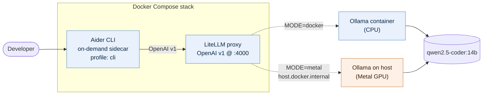
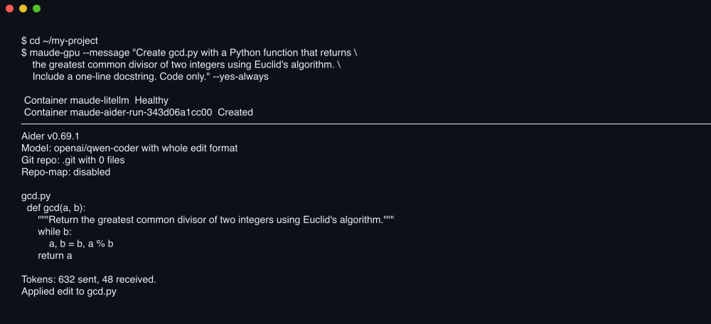

# maude

A fully-offline, agentic coding assistant — packaged as a Docker Compose stack
that turns up the same way on any machine, with or without internet.

## Features

- **One-command turnup.** `./turnup.sh` brings up the stack; `./maude`
  drops you into Aider against the local model. `./maude-cpu` and
  `./maude-gpu` are thin wrappers that preset the backend mode.
- **Two backend modes**, picked by `MODE=docker` (default) or `MODE=metal`:
  - `docker` — Ollama runs as a container. Single self-contained stack.
    CPU inference on macOS (Linux containers can't see Apple's Metal GPU).
    Saturates all cores during generation.
  - `metal` — Ollama runs natively on the macOS host with Metal/GPU
    acceleration. Roughly 5–10× faster generation on Apple Silicon and
    keeps the CPU idle. Only LiteLLM and Aider live in compose.
- **OpenAI-compatible endpoint** at `http://127.0.0.1:4000` via LiteLLM, so
  anything that speaks OpenAI (Aider, OpenWebUI, IDE plugins, custom
  scripts) just works against the local model.
- **Agentic coding via Aider**, run on demand in a sidecar container with
  the current directory mounted at `/workspace`. Files Aider writes land
  on the host with your UID (the launcher passes `--user $(id -u):$(id -g)`).
- **Reproducible offline turnup.** `./fetch-assets.sh` once on an online
  machine produces a self-contained `./assets/` tree (saved Docker images
  + Ollama model blobs); `./turnup.sh` on the offline machine then never
  touches the network. Idempotent — re-runnable, skips work already done.
- **Pinned versions** end to end — Ollama 0.4.7, LiteLLM main-stable, Aider
  0.69.1, Qwen 2.5 Coder 14B. Mode swaps don't change the model behaviour.
- **Local-only by design.** Both LiteLLM and Ollama bind to `127.0.0.1`.
  No telemetry, no outbound calls after fetch-assets completes.
- **Healthchecked.** Containers expose proper Docker healthchecks; turnup
  blocks until services report healthy before printing success.
- **Profile-scoped services.** Ollama lives in the `docker-backend`
  Compose profile so metal mode excludes it cleanly; Aider lives in the
  `cli` profile so it never runs on its own — only via the launcher.

## Tech stack

| Layer | Component | Pinned version | Role |
|---|---|---|---|
| Model | [Qwen 2.5 Coder 14B](https://ollama.com/library/qwen2.5-coder) | `qwen2.5-coder:14b` | Code-tuned 14B-parameter LLM. ~9 GB on disk, ~10 GiB resident. |
| Model server | [Ollama](https://ollama.com) | `ollama/ollama:0.4.7` | Loads the GGUF weights, exposes the Ollama HTTP API on :11434. Metal-aware on host; CPU-only in containers. |
| OpenAI shim | [LiteLLM](https://github.com/BerriAI/litellm) | `ghcr.io/berriai/litellm:main-stable` | Translates OpenAI `/v1/chat/completions` to Ollama's API. One LiteLLM config per backend mode (`config.docker.yaml`, `config.metal.yaml`). |
| Agent | [Aider](https://aider.chat) | `aider-chat==0.69.1` | Agentic git-aware editor. Runs in a `python:3.12-slim` sidecar built locally. |
| Orchestration | Docker Compose v2 | n/a | Single `docker-compose.yml`; services gated by profiles (`docker-backend`, `cli`) and the `MODE` env var. |
| Glue | Bash scripts | — | `fetch-assets.sh`, `turnup.sh`, `maude`, `maude-cpu`, `maude-gpu`. Tested with `set -euo pipefail`. |
| Asset storage | local filesystem (default) | — | `assets/` is gitignored. Git LFS patterns are pre-declared in `.gitattributes` if you want to vendor them. |

## About the model — Qwen 2.5 Coder

**Maker.** [Alibaba Cloud's Qwen team](https://qwenlm.github.io/). The 2.5-Coder
family was released in late 2024 as a code-specialised continuation of Qwen 2.5.
Apache-2.0 weights, distributed via Hugging Face and the Ollama registry.
Technical report: [arXiv 2409.12186](https://arxiv.org/abs/2409.12186).

**Family.** Six sizes — 0.5B, 1.5B, 3B, 7B, **14B (the one this stack ships
with)**, and 32B. The 14B is the practical sweet spot for a 32 GB Apple Silicon
machine; the 32B is positioned by the Qwen team as the strongest open-weight
code model published in its release window. Smaller variants exist for
edge / completion-only use cases.

**Training.** Qwen 2.5 base + ~5.5 trillion additional tokens of code-heavy
material. Includes fill-in-the-middle (FIM) training and explicit structural
tokens for repository boundaries, which helps when the model is asked to
reason across files rather than just inside one function.

**Capabilities.**

- Code generation across **92+ programming languages**.
- Code completion and infilling (good fit for IDE-style use).
- Bug repair, refactoring, code-to-text explanation.
- 32k native context; extendable to 128k via YaRN positional scaling
  (this stack uses the default `qwen2.5-coder:14b` tag; the 32k Modelfile
  variant was dropped because it overshoots the Docker VM's RAM ceiling on
  a 32 GB host — see Troubleshooting).
- No tool-calling / function-calling protocol in the base release.
  (Aider compensates by parsing diffs from plain-text replies — slower and
  less reliable than native tool use, but it works.)

**Reported benchmarks.**

| Benchmark | Qwen 2.5 Coder 14B | Qwen 2.5 Coder 32B Instruct |
|---|---|---|
| HumanEval (pass@1)             | ~89.9% | 92.7% |
| MBPP+ (pass@1)                 | ~82%   | 90.2% |
| EvalPlus (composite)           | —      | Best open-source result at release; beats DeepSeek-Coder-V2-Instruct. |

(Numbers from the Qwen technical report and Ollama / Open Laboratory write-ups
— see "Further reading" below.)

### How does it compare to Claude Opus?

Honest answer: it's a different weight class, and the framing depends on what
you're measuring.

| Dimension | Qwen 2.5 Coder 14B (local) | Claude Opus 4.7 (hosted) |
|---|---|---|
| Parameter count | ~14 B (open weights) | not disclosed; orders of magnitude larger |
| Where it runs | Your laptop, offline, no API key | Anthropic API, paid, requires internet |
| HumanEval-style **single-function** tasks | ~90% (competitive — the benchmark saturates here) | High, but this benchmark stopped being a discriminator years ago |
| **SWE-bench Verified** (real GitHub issues, agentic) | Open small models trail badly without heavy scaffolding | **82.4%** — current state-of-the-art |
| Long-horizon agentic work, multi-file refactors | Loses thread quickly, repeats edits, struggles with planning | Strong; this is what Claude Code is built on |
| Native tool / function calling, MCP | None in the base model | First-class |
| Multimodal input (images, PDFs, diagrams) | No | Yes |
| Privacy / data residency | Stays on your disk | Sent to Anthropic's API |
| Latency for short replies | A few seconds local (GPU) / tens of seconds (CPU) | Sub-second typical |
| Cost per token | $0 after install | Hosted pricing |

**The honest framing.** If you want a code completion that fills in a function
body, refactors a class, or rewrites a regex, Qwen 2.5 Coder 14B is usually
fine — and being local + free + private is a meaningful advantage. If you
want to hand the assistant a real GitHub issue, let it browse the codebase,
run tests, and iterate to a passing PR, you want Opus (and a paid API key).
This repo is the former, not the latter. Use the right tool for the size of
the task.

### Further reading

- Qwen 2.5 Coder technical report — [arXiv:2409.12186](https://arxiv.org/abs/2409.12186)
- Qwen 2.5 Coder blog post — [qwenlm.github.io/blog/qwen2.5-coder/](https://qwenlm.github.io/blog/qwen2.5-coder/)
- Open Laboratory model card — [Qwen 2.5 Coder 32B](https://openlaboratory.ai/models/qwen-2_5-coder-32b)
- Anthropic Claude Opus 4.7 benchmarks — [Vellum write-up](https://www.vellum.ai/blog/claude-opus-4-7-benchmarks-explained)

## Architecture



## Prerequisites

- **Docker** Desktop (macOS, Windows) or Docker Engine (Linux), with Compose v2.
- For `MODE=metal`: macOS on Apple Silicon and `brew install ollama`.
- ~12 GB free disk for the 14b bundle.
- Enough free RAM for the model:
  - 16 GB+ for docker mode (CPU keeps weights in container memory).
  - 16 GB+ for metal mode (Metal shares unified memory with the CPU).

## Deployment guide

### 1. One-time asset fetch (needs internet)

The repo ships only code. Run the fetch script once on a machine with
internet to populate `./assets/`:

```bash
git clone git@github.com:binRick/maude.git
cd maude
./fetch-assets.sh
```

This will:

1. `docker pull` Ollama and LiteLLM at pinned versions, `docker build` Aider,
   and `docker save` each into `assets/images/*.tar` *immediately* after pull
   (Docker Desktop's auto-GC otherwise eats unsaved images during step 2).
2. Spin up a throwaway Ollama with `assets/ollama-data/` mounted and
   `ollama pull qwen2.5-coder:14b`, so all the model blobs land in the repo.

End state: `assets/` is ~11 GB (2.9 GB images + 8.4 GB model). The repo's
`.gitignore` skips `assets/` by default; see "Storage notes" below for
options if you want to vendor it.

### 2. Bring the stack up

```bash
./turnup.sh                  # docker mode (default, CPU on Mac)
MODE=metal ./turnup.sh       # metal mode (Apple GPU)
```

`turnup.sh` is idempotent:

- Loads any `assets/images/*.tar` not already in Docker (`docker load`).
- In docker mode: starts the `docker-backend` compose profile (ollama +
  litellm).
- In metal mode: sets `OLLAMA_HOST=0.0.0.0:11434` via `launchctl setenv`
  so containers can reach the host, starts `brew services ollama`,
  rsync-seeds `~/.ollama` from `assets/ollama-data/` if the model isn't
  already on the host, then starts just litellm.
- Waits for healthchecks before reporting success.

### 3. Use Aider against the local model

```bash
# inside any git repo — default (docker mode, CPU)
/path/to/maude/maude

# convenience wrappers
/path/to/maude/maude-cpu        # MODE=docker (container Ollama)
/path/to/maude/maude-gpu        # MODE=metal  (host Ollama, Apple GPU)
```

The launcher starts the backend if it isn't running, then runs Aider in a
one-shot container with the current directory mounted at `/workspace`.
Add the launcher to your `PATH` and just type `maude` (or `maude-gpu`).

### 4. Tear down

```bash
# docker mode — ollama lives in compose, include the profile when stopping
COMPOSE_PROFILES=docker-backend docker compose down

# metal mode — only litellm is in compose; host ollama keeps running
docker compose down
brew services stop ollama   # if you also want to stop host ollama
```

## Usage examples

All screenshots below are real terminal output captured against this stack
running locally — Ollama 0.4.7, LiteLLM main-stable, Qwen 2.5 Coder 14B —
rendered with [`charmbracelet/freeze`](https://github.com/charmbracelet/freeze).

### Stack overview — `docker ps`

Healthy compose stack after `./turnup.sh` (metal mode shown — only the
LiteLLM container; in docker mode you'd also see `maude-ollama`).


### What the model is doing — `ollama ps`

`PROCESSOR` is the headline number. In metal mode the host Ollama loads
the model on the M-series GPU (`100% GPU`); in docker mode it falls back
to `100% CPU` and pegs every core during generation.


### Use the model directly — `curl` the OpenAI-compatible endpoint

Anything that speaks OpenAI v1 works against `http://127.0.0.1:4000`.
Here the model returns a real GCD implementation in response to a chat
completion call.


### Agentic editing — `maude-gpu` driving Aider

The launcher mounts your CWD into the Aider container, points it at the
local LiteLLM endpoint, and lets the model read and write files. Below is
a non-interactive invocation (`--message ... --yes-always`) that creates a
file from scratch.



## OpenAI-compatible endpoint

LiteLLM exposes one model name, `qwen-coder`, at `http://127.0.0.1:4000`.
Use it from anything that speaks OpenAI:

```bash
curl -sS http://127.0.0.1:4000/v1/chat/completions \
  -H "Authorization: Bearer sk-maude-local" \
  -H "Content-Type: application/json" \
  -d '{"model":"qwen-coder","messages":[{"role":"user","content":"hi"}]}'
```

The `sk-maude-local` key is set in `litellm/config.*.yaml`. The
proxy is bound to `127.0.0.1` only; the key is defence-in-depth, not a
secret.

## Layout

```
.
├── docker-compose.yml          # ollama (profile: docker-backend) + litellm + aider (profile: cli)
├── litellm/
│   ├── config.docker.yaml      # api_base http://ollama:11434
│   └── config.metal.yaml       # api_base http://host.docker.internal:11434
├── aider/Dockerfile            # python:3.12-slim + pinned aider-chat
├── fetch-assets.sh             # online: pull & save images, prefetch model blobs
├── turnup.sh                   # offline: docker load + compose up (MODE-aware)
├── maude                       # launcher: docker compose run --rm aider …
├── maude-cpu                   # wrapper: MODE=docker maude …
├── maude-gpu                   # wrapper: MODE=metal  maude …
├── .gitattributes              # LFS patterns (not active unless you enable LFS)
└── assets/                     # (gitignored by default)
    ├── images/*.tar
    └── ollama-data/
```

## Storage notes

`assets/` is gitignored by default because plain git doesn't handle multi-GB
blobs and GitHub's free LFS quota is 1 GB. Three options if you want a
truly clone-and-run repo:

1. **Re-run `./fetch-assets.sh` on each new machine.** Default. Needs internet
   on first turnup; cheap and simple.
2. **Enable Git LFS.** `.gitattributes` already lists the right patterns
   (`assets/images/*.tar`, `assets/ollama-data/models/blobs/**`). Run
   `git lfs install`, remove the `assets/` line from `.gitignore`, then add
   and commit. Needs paid GitHub LFS for any real use (free quota is 1 GB
   storage / 1 GB bandwidth per month and a 14b bundle is ~11 GB).
3. **Host assets elsewhere.** Push `assets/` to S3 / R2 / HuggingFace / a
   GitHub Release. Extend `fetch-assets.sh` with a download path that pulls
   from your bucket when an env var like `MAUDE_ASSETS_URL` is set.

## Troubleshooting

**`no space left on device` during fetch.** The Mac is full, not Docker.
Check `df -h /`. The Ollama image ships ~2 GB of NVIDIA CUDA libraries that
go nowhere useful on Apple Silicon but still need disk to extract. Free
host space, then retry — `fetch-assets.sh` resumes where it left off.

**`model requires more system memory than is available`.** The 14b model
at large context windows can exceed the Docker VM's RAM allocation
(~30 GiB on a 32 GB Mac). Either switch to `MODE=metal` (uses host memory
directly) or raise Docker Desktop → Settings → Resources → Memory.

**Generation feels glacial in docker mode.** Expected — Linux containers
can't reach the Apple GPU. Switch to `MODE=metal`.

**Container ollama isn't visible to `docker compose down`.** It's
profile-scoped. Either `COMPOSE_PROFILES=docker-backend docker compose down`
or `docker rm -f maude-ollama`.

**LiteLLM in metal mode can't reach the host.** `turnup.sh` sets
`OLLAMA_HOST=0.0.0.0:11434` via `launchctl setenv` and restarts the brew
service so it picks up the new bind. If you started Ollama some other way,
make sure it's not bound to loopback only.

## Notes

- The 14b model is roughly an older mid-tier hosted model: solid for
  refactors, boilerplate, and well-scoped changes; weaker at long-horizon
  reasoning than a hosted frontier model.
- Both LiteLLM and host-mode Ollama bind to `0.0.0.0` internally but only
  the loopback interface is mapped — your macOS firewall still gates any
  inbound traffic; this stack is local-only.
- No telemetry. No outbound calls after `fetch-assets.sh` finishes.
